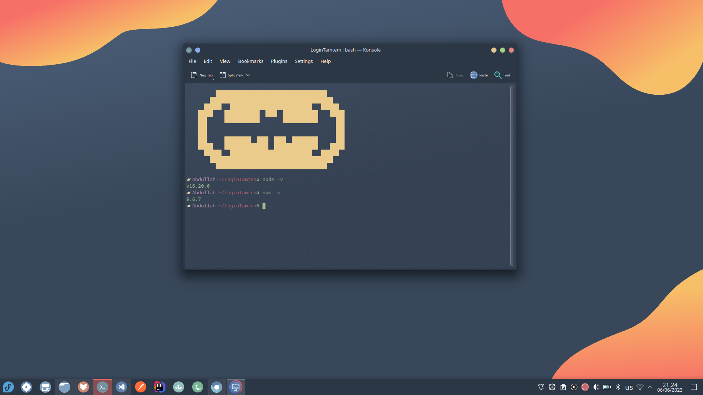

# LoginTamatem 
Login template with Specific Design,Built using framework Angular


## Prequest Installation
- Make sure you have the correct version of node.js and npm installed on your system. => to check **npm** please open **MAC OR LINUX** ***Terminal*** **On Windows** ***Windows Command Prompt(CMD)***  the following command .
  ``` npm --version OR npm -v ``` the result will be as below  if there is version Vist the link below to install node and npm [Node](https://nodejs.org/en/download)
- install Angular from  [Angular](https://angular.io/guide/setup-local) or using Command ``` npm install -g @angular/cli ```
- Create a new Angular app Called Login Tamatem using The Following Command ``` ng new TamatemLoginPage ```. 

## Scss File
At First need to create Folder inside TamatemProject using following comand ``` mkdir scss ```  then create scss file i named it ```variables.scss``` where you gonaa assign the Color value and font family as follow:  
``` $login_buttons: #C3001E; 
$field_text_color: #000000BC; 
$field_error_border_color: #B00020; 
$field_border_color: #0000001F;
$roboto: 'Roboto', sans-serif;
```

after that i have import this file inside ***login.component.scss***
using **@import 'Path_on_your_os'**

## validition Part
 
 using validators from angular form and apply it on ```ngOnInit()```
 as shown on code above


 ## Run application
to run application do the following commands:
- cd TamatemLoginPage 
- npm i ***to install node_modules***
- ng serve 